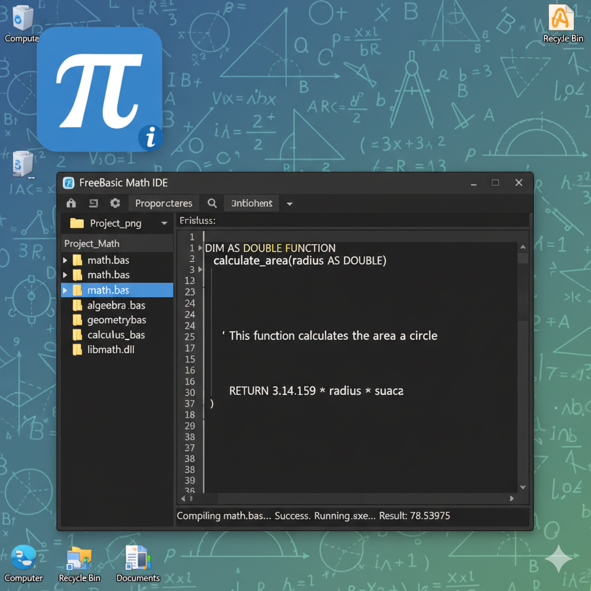

Here is a well-structured README.md template for your FreeBasic desktop math project named "./niarshye" with IDE Shye and development files related to math operations on "fog" and "gog" composite types including max and min functions:



```markdown
# ./niarshye

## Overview
./niarshye is a desktop math project developed in FreeBasic using the Shye IDE. The project focuses on composite types "fog" and "gog" and provides mathematical operations such as maximum and minimum calculations for these composites.

## Features
- Composite data structures for "fog" and "gog"
- Max and Min mathematical functions for composite types
- Modular design using `.bi` header files and `.bas` implementation files
- Designed for desktop environments with FreeBasic

## Development Environment
- IDE: Shye IDE for FreeBasic
- Compiler: FreeBasic Compiler (FB)
- Supported platforms: Windows (desktop)

## Project Structure

```
./niarshye
├── src
│   ├── fog.bi         # Fog composite type declarations
│   ├── gog.bi         # Gog composite type declarations
│   ├── max.bi         # Max function declarations for fog and gog
│   ├── min.bi         # Min function declarations for fog and gog
│   ├── math.bi        # Combined math declarations for fog and gog composites
│   ├── max.bas        # Implementation of max functions
│   ├── min.bas        # Implementation of min functions
│   ├── math.bas       # Implementation of math functions integrating fog and gog
│   └── main.bas       # Main program file demonstrating usage
├── README.md          # Project overview and documentation
└── LICENSE            # Project license file
```

## How to Build and Run
1. Open Shye IDE.
2. Load the project directory `./niarshye`.
3. Compile the main.bas file which includes other modules.
4. Run the executable generated to test math functions on composites.

## Usage Example
```
#include once "math.bi"

Dim fogData As FogComposite
fogData.X = 10 : fogData.Y = 5 : fogData.Factor = 1.5

Dim gogData As GogComposite
gogData.A = 20 : gogData.B = 6 : gogData.Multiplier = 0.8

Print "Max Fog: "; MaxFog(fogData)
Print "Min Fog: "; MinFog(fogData)
Print "Max Gog: "; MaxGog(gogData)
Print "Min Gog: "; MinGog(gogData)
```

## Contribution Guidelines
- Fork the repository.
- Make your changes in feature branches.
- Submit pull requests with clear descriptions.

## License
Specify your project's license information here.

---

This README provides an organized starting point for your FreeBasic desktop math project "./niarshye" incorporating composite math for fog and gog using modular `.bi` and `.bas` files. It can be expanded with build automation, testing, and more as needed.

This answers your query about a README.md for your FreeBasic math project with IDE Shye desktop development [web:65][web:63][web:64].

[1-freecodecamp](https://www.freecodecamp.org/news/how-to-write-a-good-readme-file/)<br/>
[2-stackoverflow](https://stackoverflow.com/questions/23989232/is-there-a-way-to-represent-a-directory-tree-in-a-github-readme-md)<br/>
[3-gist](https://gist.github.com/ramantehlan/602ad8525699486e097092e4158c5bf1)<br/>
[4-gist](https://gist.github.com/DomPizzie/7a5ff55ffa9081f2de27c315f5018afc)<br/>
[5-devs](https://dev.to/developerehsan/how-to-easily-create-folder-structure-in-readme-markdown-with-two-simple-steps-3i42)<br/>
[6-reddit](https://www.reddit.com/r/webdev/comments/18sozpf/how_do_you_write_your_readmemd_or_docs_for_your/)<br/>
[7-youtube](https://www.youtube.com/watch?v=7Tk15l23Ctg)<br/>
[8-project](https://thousandbrainsproject.readme.io/docs/code-base-structure)<br/>
